# nvim-vimpad

Like codi and luapad but for vimscript.

Makes use of the virtual text feature in neovim.

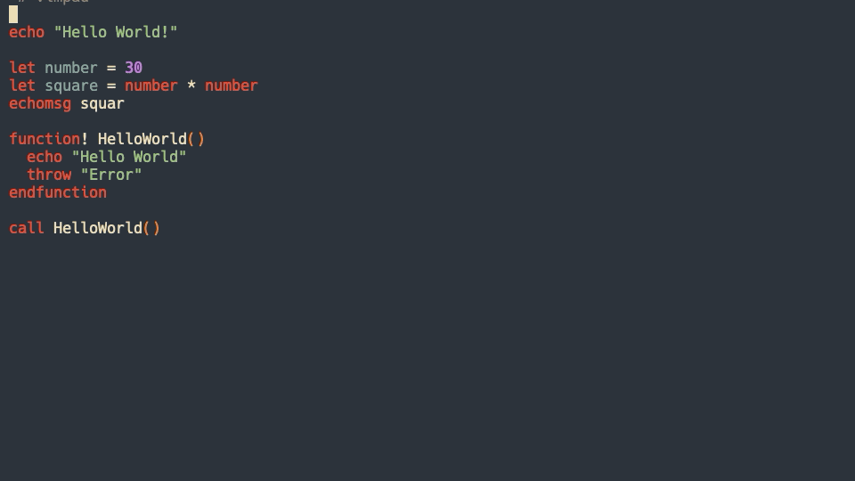


## Installation

* vim-plug
```viml
Plug 'yuki-uthman/nvim-vimpad'
```

* vundle
```viml
Plugin 'yuki-uthman/nvim-vimpad'
```

* minpac:
```viml
call minpac#add('yuki-uthman/nvim-vimpad')

" for lazy loading
call minpac#add('yuki-uthman/nvim-vimpad', { 'type': 'opt' })
packadd nvim-vimpad
```


## Quickstart

No default mappings are provided with this plugin.
Put this in your init.vim.
```viml
  " change the key bindings to your liking
  nmap <leader>o <Plug>(vimpad-on)
  nmap <leader>f <Plug>(vimpad-off)
  nmap <leader>t <Plug>(vimpad-toggle)
  nmap <leader>r <Plug>(vimpad-refresh)
```
Now you can press `<leader>o` or `<leader>r` to turn on the vimpad output.
Pressing the `<leader>f` or `<leader>r` again disables it.

By default the vimpad output refreshes whenever the file is saved.
If you would like to disable that autocmd:
```viml
  let g:vimpad_refresh_on_save = 0
```

## Configurations

With no configuration, the appearance of the output looks like the one below.
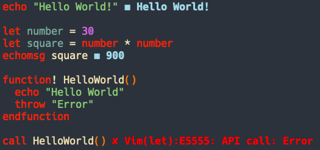

To change the prefix of the output:
```viml
  let g:vimpad_prefix = '▷▷▷'
```
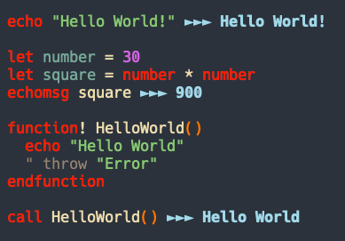


To change the prefix of the error output:
```viml
  let g:vimpad_prefix = '🧨'
```
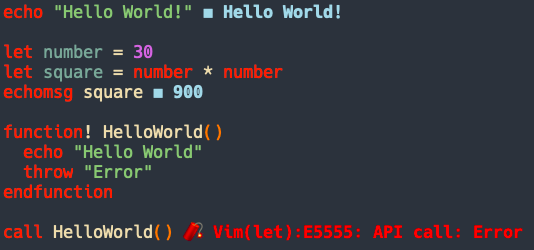

To add more spaces before output:
```viml
  " number of spaces to add in front of output
  let g:vimpad_add_space = 1
```
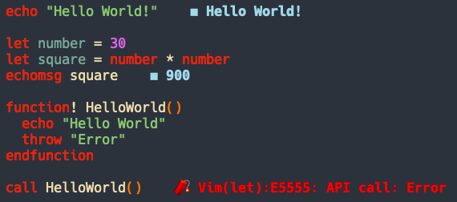


Two main highlight groups are used, `VimpadOutput` and `VimpadOutputError`. To 
change color you can link the vimpad highlight group to any existing highlight 
group provided by your colorscheme or you can define the colors yourself:
```vimL
" Linking to the existing group
highlight link VimpadOutput      PmenuSel
highlight link VimpadOutputError Error

" to see all the highlight groups
:highlight

```
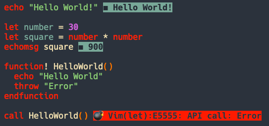

If you want to add some padding around the output:
```viml
  " number of spaces around the output
  let g:vimpad_add_padding = 1
```
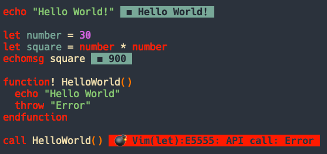


```vimL
" Defining your own colors
" for terminal
" ctermfg as the font golor
" ctermbg as the background color
highlight VimpadOutput      ctermfg=LightCyan    ctermbg=DarkBlue
highlight VimpadOutputError ctermfg=LightMagenta ctermbg=DarkMagenta

" for gui
" guifg as the font golor
" guibg as the background color
highlight VimpadOutput      guifg=LightCyan    guibg=DarkBlue
highlight VimpadOutputError guifg=LightMagenta guibg=DarkMagenta
```
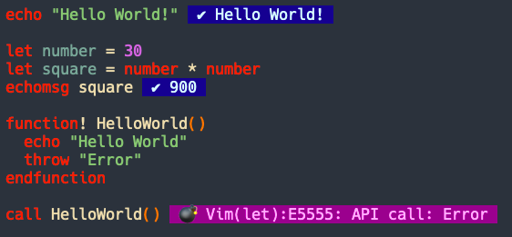

The following colors are available in most systems:
  - Black
  - Brown
  - Gray
  - Blue
  - Green
  - Cyan
  - Red
  - Magenta
  - Yellow
  - White

To see more colors:
```vimL
h cterm-colors
h gui-colors
```

To set the color using RGB:
```vimL
highlight VimpadOutput guifg=#11f0c3 guibg=#ff00ff
```

## Powerline Style Output

If you are feeling more adventurous you can also make it look like the 
powerline!

For powerline looking output you have to tweak the highlight of the shapes on 
the both side of the output. Depending on the shape you would have to reverse 
its color. The highlight groups for the shapes are VimpadPrefix and VimpadSuffix 
for the normal output and VimpadPrefixError and VimpadSuffixError for the error 
  output. The examples are shown below.

### Round shape:
```vimL
" make sure to set the style to custom!
let g:vimpad_style = 'custom'
let g:vimpad_prefix = "\uE0B6"
let g:vimpad_suffix= "\uE0B4"
highlight VimpadOutput guifg=bg guibg=Cyan
highlight VimpadPrefix guifg=bg guibg=Cyan gui=reverse
highlight VimpadSuffix guifg=bg guibg=Cyan gui=reverse

" make sure to set the style to custom!
let g:vimpad_style_error = 'custom'
let g:vimpad_prefix_error = "\uE0B6"
let g:vimpad_suffix_error = "\uE0B4"
highlight VimpadOutputError guifg=bg guibg=Red
highlight VimpadPrefixError guifg=bg guibg=Red gui=reverse
highlight VimpadSuffixError guifg=bg guibg=Red gui=reverse
```
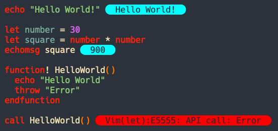

### Left arrow:
```vimL
" make sure to set the style to custom!
let g:vimpad_style = 'custom'
let g:vimpad_prefix = "\uE0B2"
let g:vimpad_suffix= "\uE0B2"
highlight VimpadOutput guifg=bg guibg=Cyan
highlight VimpadPrefix guifg=bg guibg=Cyan gui=reverse
highlight VimpadSuffix guifg=bg guibg=Cyan

" make sure to set the style to custom!
let g:vimpad_style_error = 'custom'
let g:vimpad_prefix_error = "\uE0B2"
let g:vimpad_suffix_error = "\uE0B2"
highlight VimpadOutputError guifg=bg guibg=Red
highlight VimpadPrefixError guifg=bg guibg=Red gui=reverse
highlight VimpadSuffixError guifg=bg guibg=Red 
```
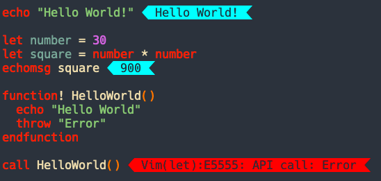


### Right arrow:
```vimL
" make sure to set the style to custom!
let g:vimpad_style = 'custom'
let g:vimpad_prefix = "\uE0B0"
let g:vimpad_suffix= "\uE0B0"
highlight VimpadOutput guifg=bg guibg=Cyan
highlight VimpadPrefix guifg=bg guibg=Cyan gui=reverse
highlight VimpadSuffix guifg=bg guibg=Cyan

" make sure to set the style to custom!
let g:vimpad_style_error = 'custom'
let g:vimpad_prefix_error = "\uE0B0"
let g:vimpad_suffix_error = "\uE0B0"
highlight VimpadOutputError guifg=bg guibg=Red
highlight VimpadPrefixError guifg=bg guibg=Red gui=reverse
highlight VimpadSuffixError guifg=bg guibg=Red 
```
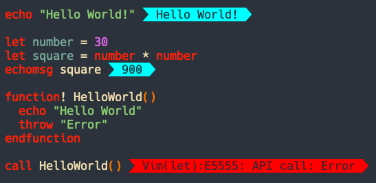


### And finally Fireeeeeeeeeeeeee:
```vimL
" make sure to set the style to custom!
let g:vimpad_style = 'custom'
let g:vimpad_prefix = "\uE0C2"
let g:vimpad_suffix= "\uE0C0"
highlight VimpadOutput guifg=bg guibg=Yellow
highlight VimpadPrefix guifg=bg guibg=Yellow gui=reverse
highlight VimpadSuffix guifg=bg guibg=Yellow gui=reverse

" make sure to set the style to custom!
let g:vimpad_style_error = 'custom'
let g:vimpad_prefix_error = "\uE0C2"
let g:vimpad_suffix_error = "\uE0C0"
highlight VimpadOutputError guifg=bg guibg=Red
highlight VimpadPrefixError guifg=bg guibg=Red gui=reverse
highlight VimpadSuffixError guifg=bg guibg=Red gui=reverse
```
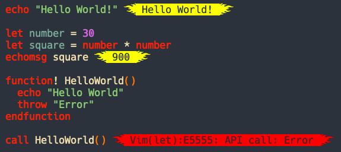

see more symbols: <br>
- [powerline-extra-symbols](https://github.com/ryanoasis/powerline-extra-symbols#glyphs)
